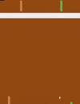
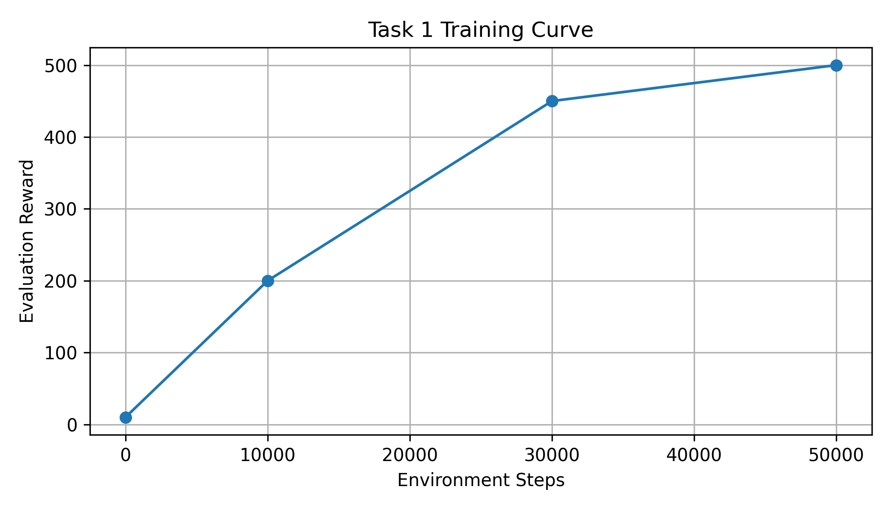
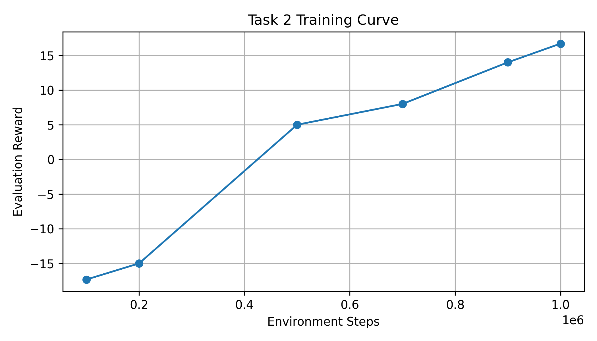
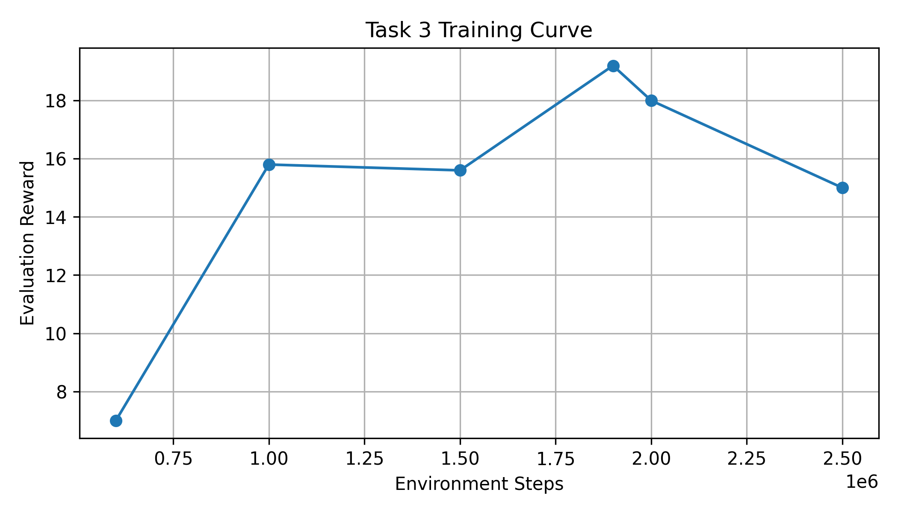

# Deep Q-Network (DQN) and Enhanced DQN Variants

## 📌 Overview

This project implements value-based reinforcement learning using Deep Q-Network (DQN) to solve both a simple control problem and a high-dimensional visual control problem.

The project contains three main tasks:

| Task   | Environment   | Method                               |
| ------ | ------------- | ------------------------------------ |
| Task 1 | CartPole-v1   | Vanilla DQN                          |
| Task 2 | Atari Pong-v5 | Vanilla DQN with visual observations |
| Task 3 | Atari Pong-v5 | Enhanced DQN                         |

For Task 3, I experimented with several DQN enhancements, including:

* Double DQN
* Prioritized Experience Replay (PER)
* Multi-step return
* Hyperparameter tuning for exploration and target network stability

The final submitted enhanced model uses:

* Double DQN
* Mild Prioritized Experience Replay
* 1-step return
* Tuned exploration schedule

The final enhanced DQN first reaches a score above 19 at **1.9M environment steps**, and the best evaluation score during training is **19.4**.

---

## 🎬 Demo Video

The following demo video presents the source code structure, implementation details, evaluation results, and trained agent performance.

[](https://www.youtube.com/shorts/uGrV9GgVTWA)


---

## 🎯 Results Summary

| Task   | Environment           | Result                                             |
| ------ | --------------------- | -------------------------------------------------- |
| Task 1 | CartPole-v1           | Mean reward = **500.0**                            |
| Task 2 | Pong-v5, Vanilla DQN  | Mean reward ≈ **16.7**                             |
| Task 3 | Pong-v5, Enhanced DQN | First reach **19.2 @ 1.9M steps**, Best = **19.4** |

---

## 📈 Training Curves

The training curves use:

* **x-axis**: environment steps
* **y-axis**: evaluation reward

### Task 1 – CartPole



Task 1 converges quickly and reaches the maximum reward of 500.

---

### Task 2 – Pong with Vanilla DQN



Task 2 shows slower learning because Atari Pong uses high-dimensional image observations. The vanilla DQN learns to play Pong effectively, reaching around 16.7 average reward.

---

### Task 3 – Pong with Enhanced DQN



Task 3 improves the vanilla DQN using algorithm-level enhancements. The enhanced DQN first reaches a score above 19 at 1.9M environment steps.

---

## 📊 Task 3 Snapshot Performance

| Environment Steps | Mean Evaluation Reward |
| ----------------: | ---------------------: |
|              600k |                    7.0 |
|                1M |                   15.8 |
|              1.5M |                   15.6 |
|              1.9M |                   19.2 |
|                2M |                   18.0 |
|              2.5M |                   15.0 |
|              Best |                   19.4 |

The performance is not strictly monotonic, which is common in reinforcement learning due to exploration, stochastic evaluation, replay buffer dynamics, and unstable value updates. The most important observation is that the enhanced model successfully reaches the score-19 threshold before 2M environment steps.

---

## 🧠 Key Techniques

### 1. Deep Q-Network

DQN approximates the action-value function with a neural network. The network predicts Q-values for each possible action, and the agent selects actions using an epsilon-greedy policy.

The Bellman target is computed as:

```text
y = r + γ max_a Q_target(s', a)
```

The model is trained by minimizing the difference between the predicted Q-value and the Bellman target using Huber loss.

---

### 2. Experience Replay

Experience replay stores past transitions in a replay buffer:

```text
(state, action, reward, next_state, done)
```

During training, mini-batches are sampled from the replay buffer. This reduces correlation between consecutive samples and improves training stability.

---

### 3. Target Network

DQN uses a separate target network to compute the Bellman target. The target network is updated periodically from the online network. This stabilizes training by preventing the target values from changing too rapidly.

---

### 4. Double DQN

Standard DQN may overestimate Q-values because the same target network is used to both select and evaluate actions.

Double DQN separates these two steps:

```text
next_action = argmax_a Q_online(s', a)
target_value = Q_target(s', next_action)
```

This reduces overestimation bias and improves learning stability.

---

### 5. Prioritized Experience Replay

Prioritized Experience Replay samples transitions according to their TD error. Transitions with larger TD errors are more likely to be sampled because they may contain more useful learning signals.

The sampling priority is:

```text
priority_i = |TD error_i| + ε
```

The sampling probability is controlled by the parameter `alpha`.

---

### 6. Multi-step Return

Multi-step return was implemented in early enhanced DQN versions. It accumulates rewards over multiple time steps before bootstrapping:

```text
G = r1 + γr2 + γ²r3 + ... + γⁿQ(s_n, a_n)
```

However, in this project, the final submitted model uses **1-step return**, because it produced more stable convergence on Pong under the final hyperparameter setting.

---

## 🧪 Enhanced DQN Version Comparison

During Task 3, I experimented with several enhanced DQN variants. All versions kept the same Atari preprocessing pipeline and the same CNN-based DQN architecture. The main differences were in replay strategy, return estimation, and stability-related hyperparameters.

| Version              | Main Idea                                                            | PER Alpha | Return Type | Memory Size | Learning Rate | Target Update | Observation                                                     |
| -------------------- | -------------------------------------------------------------------- | --------: | ----------- | ----------: | ------------: | ------------: | --------------------------------------------------------------- |
| `dqn_enhanced.py`    | Initial enhanced DQN with DDQN + PER + 3-step return                 |       0.6 | 3-step      |        100k |          1e-4 |          1000 | More aggressive learning, but less stable in Pong               |
| `dqn_enhanced_v2.py` | More conservative version with lower learning rate and 2-step return |       0.4 | 2-step      |        100k |          5e-5 |          5000 | More stable target updates, but slower learning                 |
| `dqn_enhanced_v3.py` | Stability-focused attempt with milder PER                            |       0.2 | 1-step      |        200k |          1e-4 |          2000 | Reduced instability by removing multi-step return               |
| `dqn_enhanced_v4.py` | Final selected version: DDQN + mild PER + 1-step return              |       0.2 | 1-step      |        200k |          1e-4 |          1000 | Best trade-off between learning speed and convergence stability |

---

## Why v4 Worked Best

The final v4 model worked best because it balanced learning speed and stability better than the previous variants.

### 1. Mild PER was more stable than aggressive PER

The initial enhanced version used a stronger PER setting with `alpha = 0.6`. This made the replay buffer focus heavily on high-TD-error samples.

While this can improve sample efficiency, in Pong it also made training less stable because the model repeatedly updated on surprising or noisy transitions.

In v4, I reduced PER strength to:

```text
alpha = 0.2
```

This preserved the benefit of prioritized replay while avoiding over-focusing on noisy transitions.

---

### 2. 1-step return was more stable than multi-step return

Multi-step return can propagate reward signals faster, but it also introduces higher variance.

In Pong, rewards are sparse and the policy changes throughout training. Because of this, 2-step or 3-step returns sometimes produced less stable Q-targets.

The final v4 model uses 1-step return. This made the Bellman target simpler and more stable, helping the model converge more reliably.

---

### 3. Larger replay memory improved data diversity

Earlier versions used a replay buffer size of 100k. The final v4 model uses:

```text
memory_size = 200000
```

This allows the agent to store more diverse transitions and reduces overfitting to recent gameplay patterns.

---

### 4. Exploration schedule improved late-stage convergence

The final v4 model uses:

```text
epsilon_min = 0.03
```

This allows the agent to reduce unnecessary random actions during the later training stage. This is important when the reward is already close to 19, because random actions can easily reduce Pong performance.

---

### 5. The CNN architecture was kept unchanged

Across all enhanced versions, the CNN architecture was not changed. The improvement came from algorithm-level changes such as:

* Double DQN
* PER strength
* Replay buffer size
* Return strategy
* Exploration schedule
* Target network update frequency

This makes the comparison more controlled, because the performance difference mainly comes from reinforcement learning algorithm design rather than model size.

---

## 🛠️ Installation

```bash
pip install -r requirements.txt
```

Recommended environment:

```text
Python >= 3.8
gymnasium == 1.1.1
ale-py >= 0.10.0
opencv-python
torch
wandb
imageio
imageio-ffmpeg
```

---

## ▶️ Evaluation Commands

All results are evaluated over 20 episodes using evaluation seeds 0–19.

### Task 1 – CartPole

```bash
python test_model_task1.py --model-path ./LAB5_xxx_task1.pt --episodes 20 --seed-start 0
```

---

### Task 2 – Pong Vanilla DQN

```bash
python test_model_task2.py --model-path ./LAB5_xxx_task2.pt --episodes 20 --seed-start 0
```

---

### Task 3 – Pong Enhanced DQN

```bash
python test_model_task3.py --model-path ./LAB5_xxx_task3_best.pt --episodes 20 --seed-start 0
```

---

## 🎥 Generate Gameplay Videos

Gameplay videos can be generated using the provided evaluation script.

### Task 2 Video

```bash
python test_model.py --model-path ./LAB5_xxx_task2.pt --episodes 3 --output-dir ./eval_videos_task2
```

### Task 3 Video

```bash
python test_model.py --model-path ./LAB5_xxx_task3_best.pt --episodes 3 --output-dir ./eval_videos_task3
```

---

## 📂 Project Structure

```text
.
├── README.md
├── requirements.txt
├── dqn.py
├── dqn_atari.py
├── dqn_enhanced.py
├── dqn_enhanced_v2.py
├── dqn_enhanced_v3.py
├── dqn_enhanced_v4.py
├── test_model.py
├── test_model_task1.py
├── test_model_task2.py
├── test_model_task3.py
├── images/
│   ├── task1_curve.png
│   ├── task2_curve.png
│   └── task3_curve.png
└── eval_videos/
```

---

## 🧪 Reproducibility

For reproducibility, the reported evaluation results use:

```text
20 evaluation episodes
Evaluation seeds: 0–19
```

The Task 3 training curve is reconstructed using saved model snapshots at different environment steps.

---

## 📌 Notes

* Task 1 uses low-dimensional numerical observations.
* Task 2 and Task 3 use Atari Pong image observations.
* Atari frames are converted to grayscale, resized to 84 × 84, and stacked over 4 consecutive frames.
* Training progress is measured by environment steps, not epochs.
* The final enhanced model uses Double DQN + PER + 1-step return.
* Multi-step return was implemented and tested, but was not used in the final submitted model due to less stable convergence.

---

## 👨‍💻 Author

Ching-Yu Li 李京諭

---
